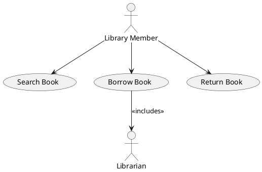
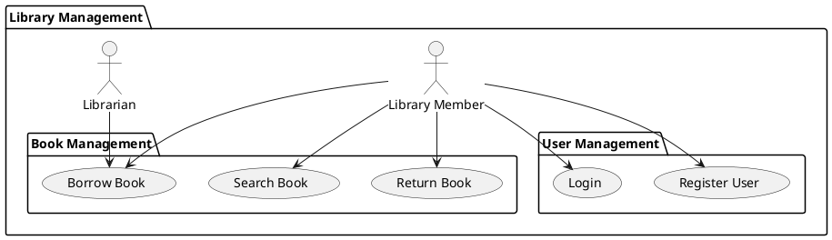
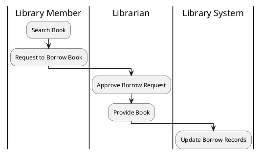

---
tags:
- akpsi
- topic
- note
Class: "[[Information System Analysis and Design Class (AKPSI)]]"
Topic: "[[Business Process and Functional Modeling]]"
---

# Use Case Diagram Examples

Some examples of the requested **Use Case Diagrams** using **PlantUML** syntax:

---

## 1. **Simple Use Case Diagram: Borrow Book**

> Usecase
![[Pasted image 20240925195712.png#invert_B]]

### Explanation:
- **Actors**: 
  - **Library Member** is the main actor who interacts with the system.
   - **Librarian** is included in the "Borrow Book" process.
- **Use Cases**:
  - The **Library Member** can **Search Book**, **Borrow Book**, and **Return Book**.
  - The **Borrow Book** use case includes **Librarian** interaction.

---

## 2. **Use Case with Subsystem: Library Management System**

> Usecase
> ![[Pasted image 20240925200105.png#invert_B]]

### Explanation:
- **Subsystems**: 
  - The **Library Management** system is broken into two subsystems: **Book Management** and **User Management**.
- **Actors**:
  - **Library Member** can interact with both subsystems.
  - **Librarian** interacts with the **Borrow Book** use case in the **Book Management** subsystem.
- **Use Cases**:
  - The **Library Member** can perform actions related to both books and user management.

---

## 3. **Use Case with Swimlanes: Borrow Book Process**

> Usecase
> ![[Pasted image 20240925200134.png#invert_B]]

### Explanation:
- **Swimlanes**:
  - The diagram is divided into three swimlanes: **Library Member**, **Librarian**, and **Library System**.
- **Flow**:
  - The **Library Member** searches for a book and requests to borrow it.
  - The **Librarian** approves the request and provides the book.
  - The **Library System** updates the borrow records after the transaction.

---

These diagrams illustrate key scenarios:
- **Simple Use Case Diagram**: Basic interaction between actors and use cases.
- **Use Case with Subsystem**: Use cases organized into logical subsystems.
- **Use Case with Swimlanes**: Clear distinction of responsibilities across different roles in a process.

---

